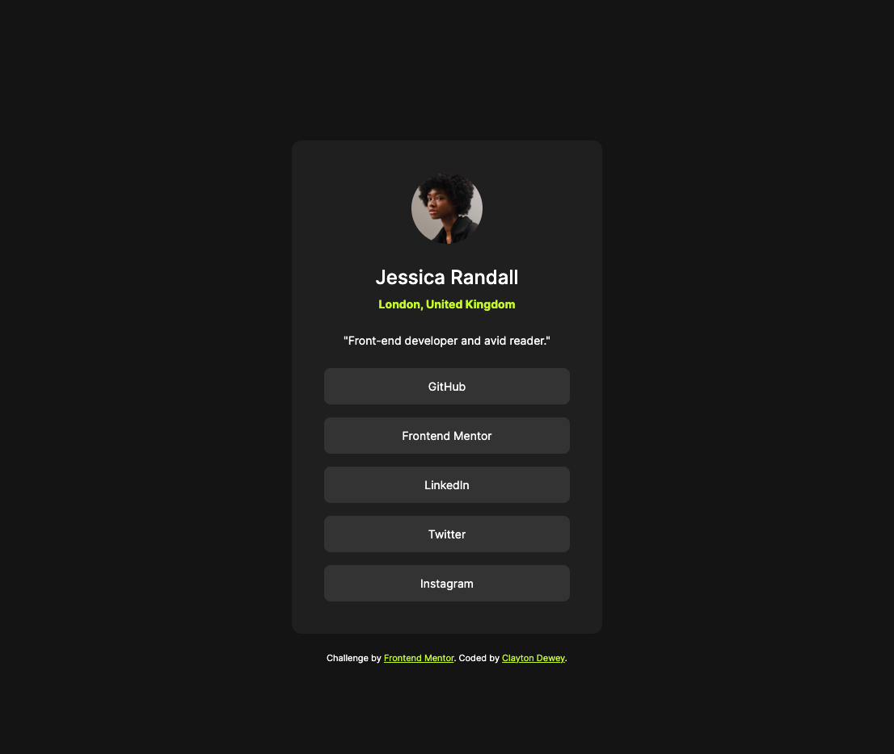

# Frontend Mentor - Social links profile solution

This is a solution to the [Social links profile challenge on Frontend Mentor](https://www.frontendmentor.io/challenges/social-links-profile-UG32l9m6dQ). Frontend Mentor challenges help you improve your coding skills by building realistic projects.

## Table of contents

- [Overview](#overview)
  - [The challenge](#the-challenge)
  - [Screenshot](#screenshot)
  - [Links](#links)
- [My process](#my-process)
  - [Built with](#built-with)
  - [What I learned](#what-i-learned)
- [Author](#author)
- [Acknowledgments](#acknowledgments)

## Overview

### The challenge

Users should be able to:

- See hover and focus states for all interactive elements on the page

### Screenshot

### Links

- Solution URL: [github.com/ClaytonDewey/fem-social-links-profile](https://github.com/ClaytonDewey/fem-social-links-profile)
- Live Site URL: [claytondewey.github.io/fem-social-links-profile](https://claytondewey.github.io/fem-social-links-profile/)

## My process

### Built with

- Semantic HTML5 markup
- CSS custom properties
- Flexbox
- Mobile-first workflow

### What I learned

I completed this project as a gimme...I've been struggling with another project and wanted something simple to take my mind off of the other project.

## Author

- Website - [Clayton Dewey](https://www.claytondewey.com)
- Frontend Mentor - [@ClaytonDewey](https://www.frontendmentor.io/profile/ClaytonDewey)
- Twitter - [@ClaytonDewey](https://www.twitter.com/ClaytonDewey)

## Acknowledgments

- [thecodercoder](https://github.com/thecodercoder) I learned a lot about Sass from her YouTube channel. I continue to use what I have learned.
